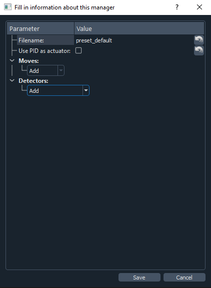
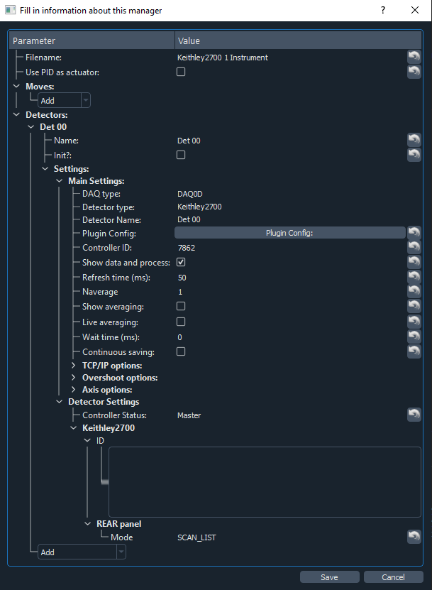

Keithley 27XX Multimeter
========================

This section focus on the Pymodaq keithley2700 plugin which is designed to interact with a Keithley 2700 Multimeter/Switch System.
It enables you to remotly control the instrument and acquire data (e.g. voltages,temperatures..)

*******************
Plugin installation
*******************

To install the plugin for your instrument, activate your Pymodaq_ENV_NAME and install the pyvisa librarie::
        $ pip install pyvisa
        
Or create your environment from the following `.yml`_:

.. _.yml: 
    
The pymodaq_plugin_keithley package is available `here`_:

.. _here: https://git-cethil.insa-lyon.fr/instrumentation/Cethil-Acquisition/-/tree/master/Keithley/pymodaq_plugins_keithley?ref_type=heads

Once downloaded, extract the package in the local repository you want, and install it::

    $ pip install pymodaq_plugin_keithley

.. note::
    The plugin requires the python package pyvisa to cummunicate with the instrument.

******************
Instrument control
******************

Hardware
********

- Connect the Keithley power supply cable
- Connect the Keithley to the PC (RS232 connexion is the only one supported at this point, later will be implemented GPIB/TCIP)
- Power on the Keithley

Software
********

- Launch Pymodaq dashboard running (in your dedicated environmnent) the command::

    $ dashboard

This window should open (if not, please check carefully the previous installation procedure, you may have installed the wrong version or miss a necessary package):

    .. image:: ../images/pymodaq_dashboard.PNG
        :width: 1000

- Load existing preset, if not, you can create a new one as shown below:

|image 1|   |image 2|

.. warning::
    | Problem still unsolved:
    | Init?: must not be ticked, otherwise the daq_viewer can't be launched from the dashboard

- The daq_viewer window open automaticaly when loading preset. Instead of using the dashboard, you can run it directly through your prompt running::

    $ daq_viewer

The generated window is the main daq_viewer window which relate the code to the user interface, allowing the acquisition process.